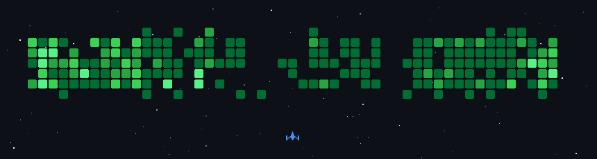

# Freelance Web & App Developer

I build web and mobile applications, making clean and scalable solutions.

### What I work with

**Frontend** — React, Next.js, TypeScript, [Miniframe](https://github.com/9elt/miniframe)  
**Backend** — Node.js, Express, Prisma, PostgreSQL, MongoDB, Firebase  
**Mobile** — React Native, Expo  
**Other** — C, Java  
**Design** — Figma, Illustrator · [Dribbble](https://dribbble.com/ontech7dev/about)

I contribute to open-source :D

### Outside of work

[Photography](https://500px.com/p/ontech7/galleries/photos) · [Coffee](https://vimeo.com/1109594645) · Bouldering · 3D printing
· Custom keyboards · Drum & bass

---

<a href="https://linkedin.com/in/andrea-losavio">LinkedIn</a> · <a href="https://andrealosavio.com">Website</a> · DM on GitHub

powered by <a href="https://github.com/czl9707/gh-space-shooter">gh-space-shooter</a>

